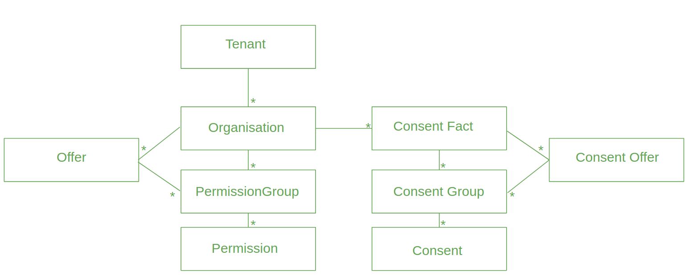

# API

**Nio** features are provided through it's API.

## Swagger

Swagger for API documentation may be found [here](https://raw.githubusercontent.com/MAIF/nio/master/nio-server/public/swagger/swagger.json).

## Model

@@@ div { .centered-img }

@@@

### Tenant

A *Tenant* is a dedicated environment that is totally isolated from other tenants.

### Organisation

*Organisation* element represents an organisation (business organisation or any kind of organisation) that as a set of associated permissions.


Organisation example :

```json
{
  "key": "string",
  "label": "string",
  "groups": [
    {
      "key": "string",
      "label": "string",
      "permissions": [
        {
          "key": "string",
          "label": "string"
        }
      ]
    }
  ],
  "version": {
    "status": "string",
    "num": 0,
    "latest": true,
    "neverReleased": true,
    "lastUpdate": "string"
  }
}
```

### Permission group

A *Permission Group* is a set of permissions (this is actually a functionnal gathering).

### Permission

A *Permission* is an actual permission for a given authorisation (ex : "I authorise CompanyX to send me promotional emails").


### User

A *User* is a user in the scope of your organisation. User's **id** is his **id** in your organisation.

```json
{
  "userId": "string",
  "orgKey": "string",
  "lastUpdate": "string",
  "doneBy": {
    "userId": "string",
    "role": "string"
  },
  "version": 0,
  "groups": [
    {
      "key": "string",
      "label": "string",
      "consents": [
        {
          "key": "string",
          "label": "string",
          "checked": true
        }
      ]
    }
  ]
}
```

### Consents

*Consent* element stands for the actual user consent for a given permission.

## Versionning

*Permissions* and *Consents* are versionned in order to be able to handle changes in the permissions to be able to know at anytime which version of the permissions have been approuved by the user.

## Typical workflow

Here is a typical workflow of nios usage.

### Init

Create `dev` tenant :

```shell
curl -X POST "https://<nio-url>/api/tenants" \
-H 'Opun-Client-Id: <client-id>' \
-H 'Opun-Client-Secret: <client-secret>' \
-H 'tenant-admin-secret:<tenant-admin-id>' \
-H 'Content-Type: application/json' \
-H 'Accept: application/json' \
--include \
-d '{"key": "dev","description": "dev tenant"}'
```

Create organisation :

```shell
curl -X POST \
  "https://<nio-url>/api/dev/organisations" \
  -H 'accept: application/json' \
  -H 'content-type: application/json' \
  -H 'Opun-Client-Id: <client-id>' \
  -H 'Opun-Client-Secret: <client-secret>' \
  -d '{
    "key": "exampleorg",
    "label": "Example Organisation",
    "version": {
        "status": "RELEASED",
        "num": 1,
        "latest": true
    },
    "groups": [{
        "key": "groupexample",
        "label": "Group Example",
        "permissions": [{
            "key": "premissionexample",
            "label": "Permission example"
        }]
    }]
}' \
--include
```

### Consents update

GET consents `template` for the given organisation :

```shell
curl -X GET "https://<nio-url>/api/dev/organisations/exampleorg/users/_template" \
-H 'accept: application/json' \
-H 'content-type: application/json' \
-H 'Opun-Client-Id: <client-id>' \
-H 'Opun-Client-Secret: <client-secret>'
```

PUT filled `template` :

```shell
curl -X PUT \
  "https://<nio-url>/api/dev/organisations/exampleorg/users/<user-id" \
  -H 'accept: application/json' \
  -H 'content-type: application/json' \
  -H 'Opun-Client-Id: <client-id>' \
  -H 'Opun-Client-Secret: <client-secret>' \
  -d '{
    // the filled template ...
  }'
```
