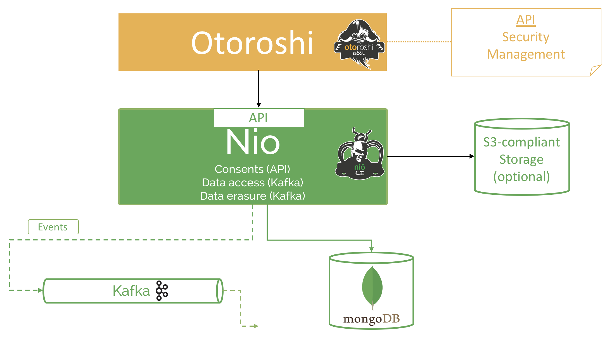

# Architecture

We chose to make Nio the central part of our privacy management and provides API to manage consents for your users, request data extraction or request information deletion. 

@@@ div { .centered-img }

@@@


Nio tries to embrace @ref:[global philosophy](./about.md#philosophy) by providing a full featured REST admin api, a gorgeous admin dashboard written in [React](https://reactjs.org/) that uses the api. 
Architecture is composed of a JVM-compliant service (Play2 + Scala), a MongoDB database and a Kafka Broker. 


@@@ div { .centered-img }

@@@

## Database

**Nio's** database is useful to stores consents and account data.

You can choose between Mongo or Postgres (at least 9.6), by default Nio uses Mongo database

### Multi-tenancy

**Nio's** database is multi-tenant, which let's you instanciate multiple environnement with only one database. This can be very useful for any *non-prod* envs.

## Events Broker

**Nio** provides events through a Kafka broker (Kafka is the only supported broker for now).

## (Optional) S3-compliant storage for events record management

**Nio** also provides events record management which consists in a chained event logs that needs to be stored in a S3-compliant store.

Record management is optional.

To enable record management, you have to specify an environment variable : 

```sh 
export ENABLE_RECORD_MANAGEMENT=true
export ENABLE_S3_MANAGEMENT=true
```

## (Optional) email notification using mail gun.

**Nio** provides features to send e-mails using [Mail Gun](https://www.mailgun.com/). For the moment, we manage the sending of an e-mail during the finalization of a request of extraction of data with the link of the file to be downloaded.

Email sending is optional.

To enable mail gun, you have to specify an environment variable : 

```sh 
export ENABLE_MAIL_SENDING=true
```

and specify the mail gun configuration :

```sh
export MAIL_GUN_API_KEY=<my-mail-gun-api-key>
export MAIL_GUN_SENDER=<mymailgun@sender.com>
export MAIL_GUN_ENDPOINT=<https://api.mailgun.net/v3/my-mail-gun-domain>
```