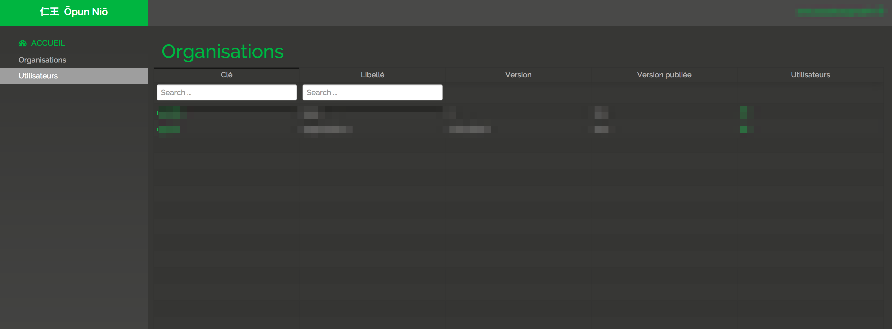
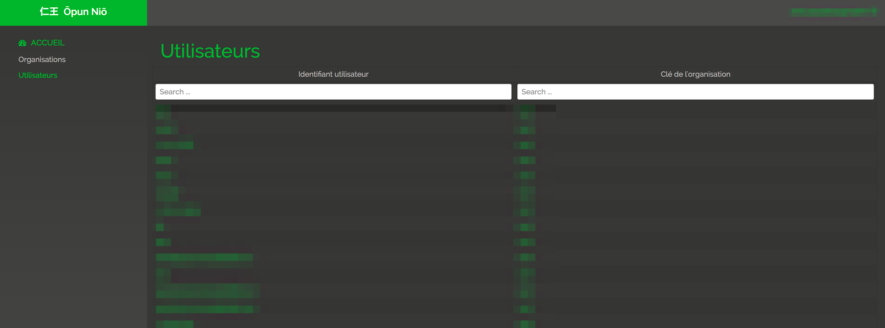
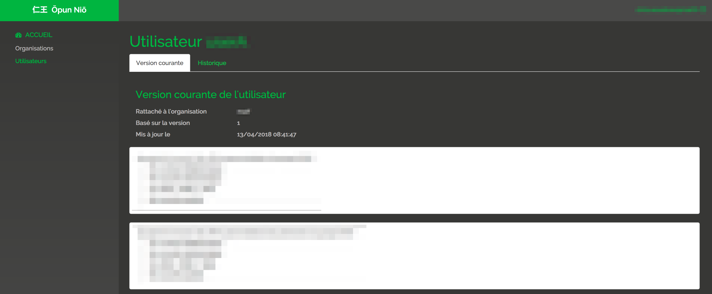

# Back Office

Each tenant comes with its own data, it also comes with its own back office.

## Acess

Backoffice is accessible through the following url :

> https://<nio-url>/<tenant>/bo

## Organisations View

Organisation view provides the list of organisations in the given tenant.

@@@ div { .centered-img }

@@@

## Users View

Users view provides the list of users in the given tenant.

@@@ div { .centered-img }

@@@

## Consents View

Organisation view provides the list of users in the given tenant.

@@@ div { .centered-img }

@@@
