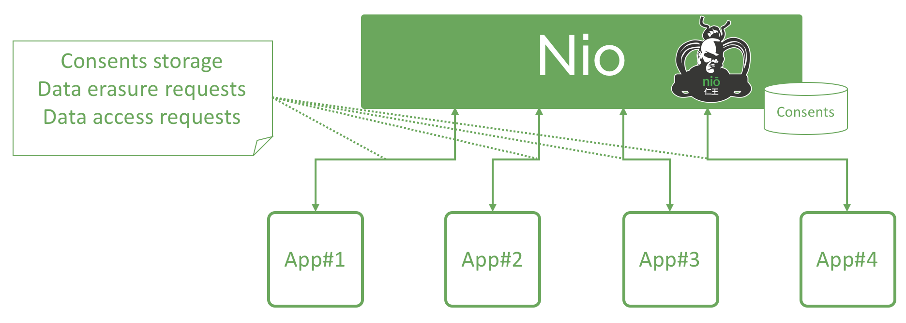

# Nio

[GDPR](https://en.wikipedia.org/wiki/General_Data_Protection_Regulation) is the new EU reglementation on data protection and data privacy.

**Nio** is a privacy management toolbox designed to implement GDPR. The aim of **Nio** is to provide tools to handle, main features are :

* Consents management
* Data access request API (simple access or portability)
* Data erasure request API

@@@ div { .centered-img }
 
@@@

@@@ div { .centered-img }

@@@

@@@ warning

Work is still in progress, stay tuned for our next releases.

Coming next :

* OAuth2 integration
* Configurable email notifications
* Front Office
* ...

@@@

**Nio** does not to the effective erasure or the effective access in yout information system (who knows better than your team and your operating system how to provide and to erase data).

@@@ div { .centered-img }

@@@

> A famous Japanese wooden Kongorikishi (Agyō) statue at Tōdai-ji, Nara (World Heritage Site). It was made by Busshi Unkei and Kaikei in 1203
Niō (仁王) or Kongōrikishi (金剛力士) are two wrathful and muscular guardians of the Buddha standing today at the entrance of many Buddhist temples in East Asian Buddhism in the form of frightening wrestler-like statues. - source : [Wikipedia](https://en.wikipedia.org/wiki/Nio)

@@@ index

* [About Nio](about.md)
* [Architecture](archi.md)
* [Features](features.md)
* [Quickstart](quickstart.md)
* [API](api.md)
* [Events](events.md)
* [Back Office](backoffice.md)
* [Record Manager](recordmanagment.md)

@@@
