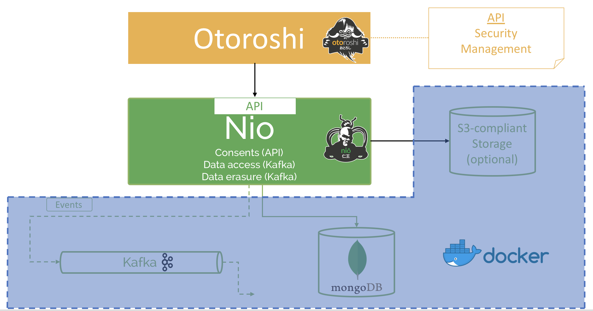

# Quickstart

This is a quick start guide to start with **Nio**.

## Docker Image

You want to start quick ? We provide a docker image in order to be able to start whitout installing all elements of the Architecture.

@@@ div { .centered-img }

@@@

## Getting started

First install [Docker](https://docs.docker.com/install/) for your favorite operating system.

Start Docker :

```sh
sudo docker-compose up
```

You will need to install [SBT](https://www.scala-sbt.org/download.html?_ga=2.189648747.1180427007.1527096641-566511216.1527096641) and [Yarn](https://yarnpkg.com/lang/en/docs/install/#mac-stable) first.


Start server in dev mode:
```sh
sbt 'project nio-server' '~run'
```

Start client in dev mode :
```sh
cd nio-server/javascript
yarn install
yarn start
```
