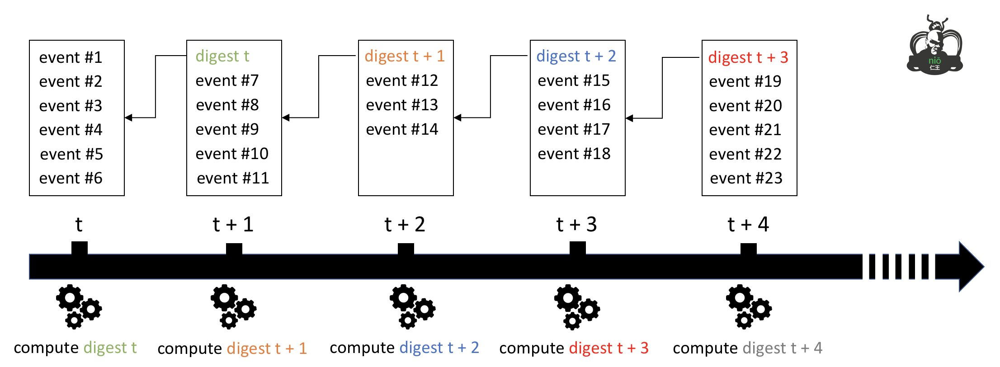

# Record Management

> This feature is optional, work is still in progress

**Nio** provides on a record manager to increase traçability. Nio creates periodically log files containing all [events](events.md) that have been produced by Nio since previous record.

A digest of previous of the previous log file is computed and will be stored in the next log file.

@@@ div { .centered-img }

@@@
