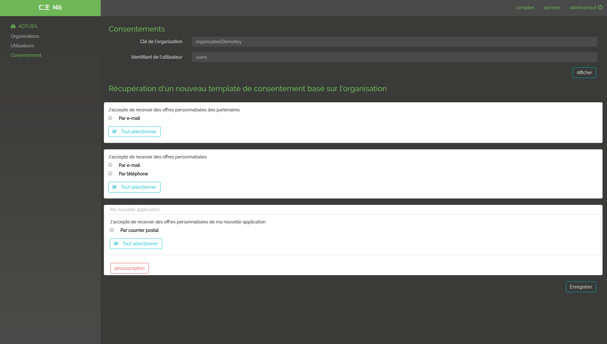
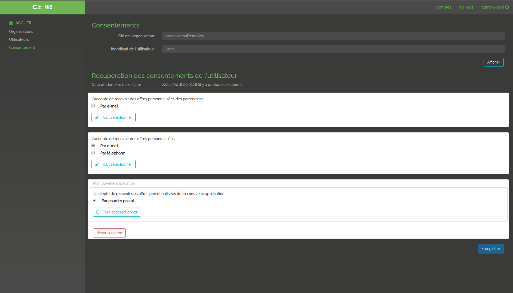
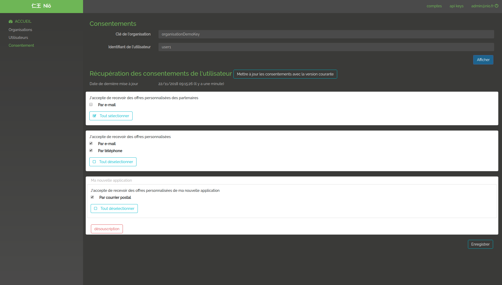

# Manage Consents

Once the organization and permissions are generated. The user will be able to manage consents and modifiers. Consent management is done by accepting or refusing the authorizations requested by the organization. For a new user, one can retrieve the last published version of the permissions of the organization. 

## Get consent fact

If no consent are available for this user, we retrieve the consent structure from the latest published version of the organization. The offers will be filtered by the user context.

@@@ div { .centered-img }

@@@

## Existing consent

Retrieving saved consents for a given user for a given organization filtered by the user context.

@@@ div { .centered-img }

@@@

## Notification if a new organisation released version is available 

On UI, if you display consents validate by a user and if the organization have released a new version, you can update your consents version with the new organization template.

@@@ div { .centered-img }

@@@
