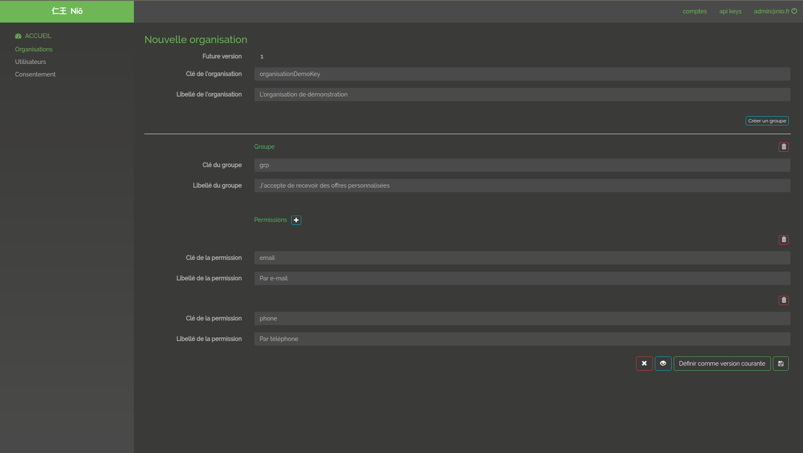
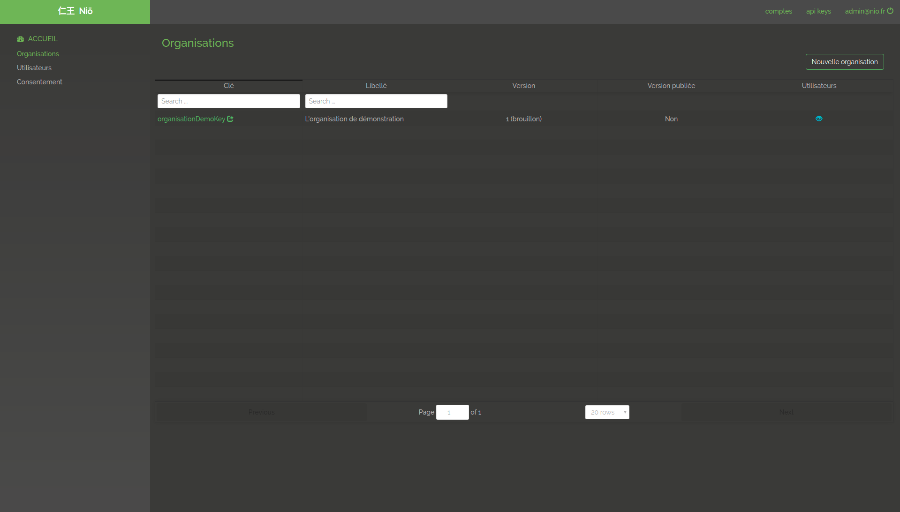
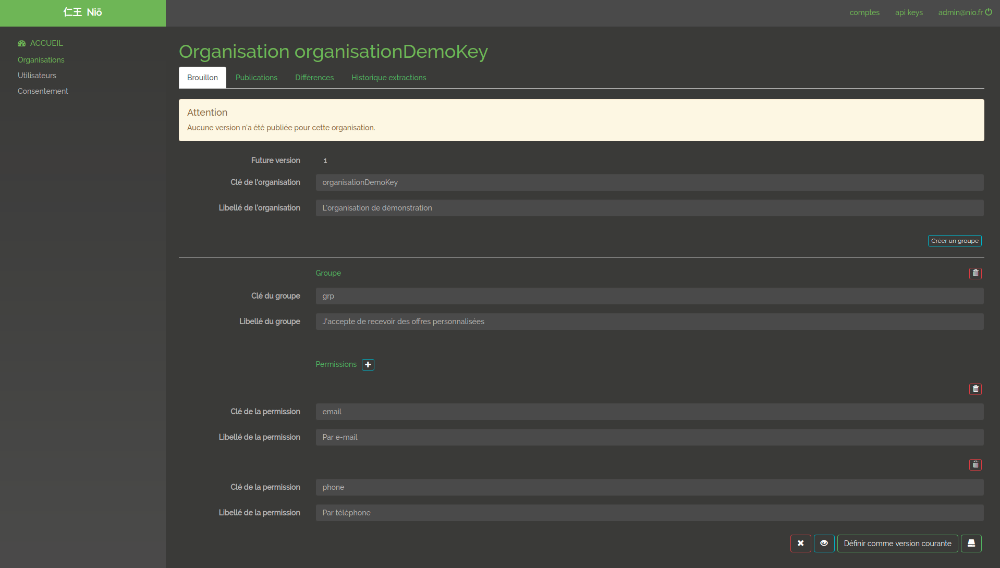
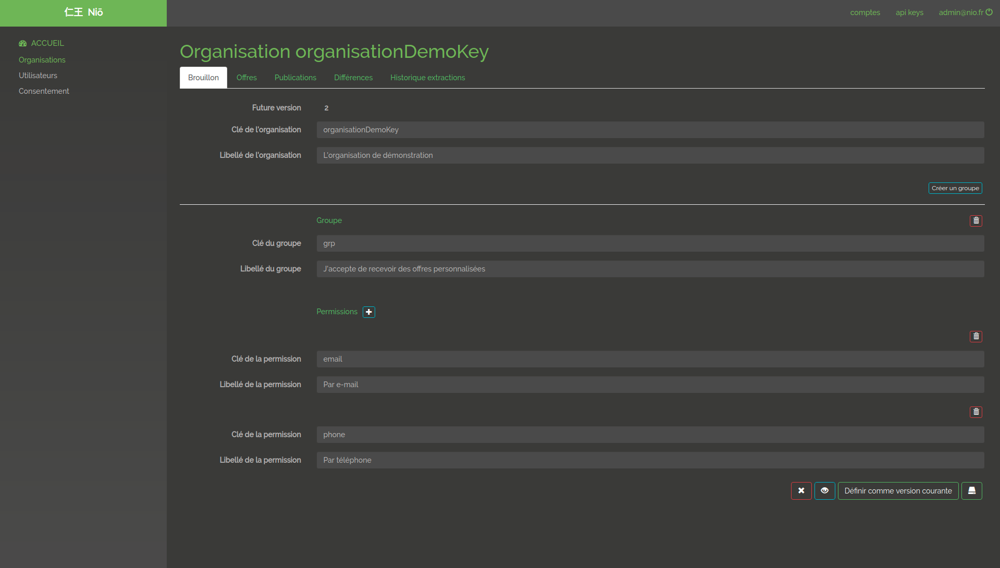
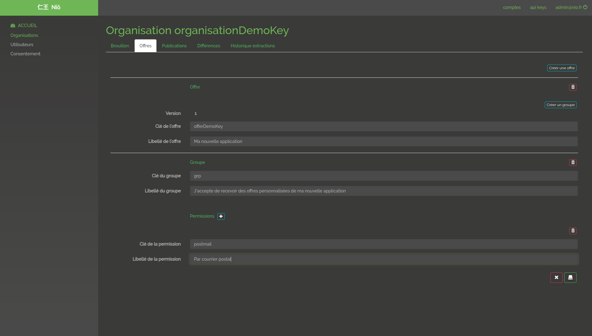

# Manage Organisations

The organization is a logical entity, as for example Maif, Altima ... Groups can be defined in an organization, as for example within the Maif organization one can have a Maif group and a Maif partner group. Permissions are defined for each of these groups (for example contact by e-mail, phone ...) Version management is done in draft or publication.The draft version can be published, so it will become non-modifiable but a new draft version will be created.

## New organisation

Creation of a new organization by specifying the different desired permissions by grouping them together.

@@@ div { .centered-img }

@@@

## Organisations

Retrieving the list of known organizations either by taking the latest version published for this organization or by taking the draft version.

@@@ div { .centered-img }

@@@

## Edit organisation draft

Retrieving the draft for a given organization. Note, if an organization exists it necessarily has a draft version available.

@@@ div { .centered-img }

@@@

## Released a new organisation version

Publication of the current draft version of the organization. This will publish a draft, create a new draft from the published version by incrementing the draft version for the next release.

@@@ div { .centered-img }

@@@

## Manage offers on organisation

The notion of offer corresponds to the addition of specific permissions to an application on a given organization.

@@@ div { .centered-img }

@@@

